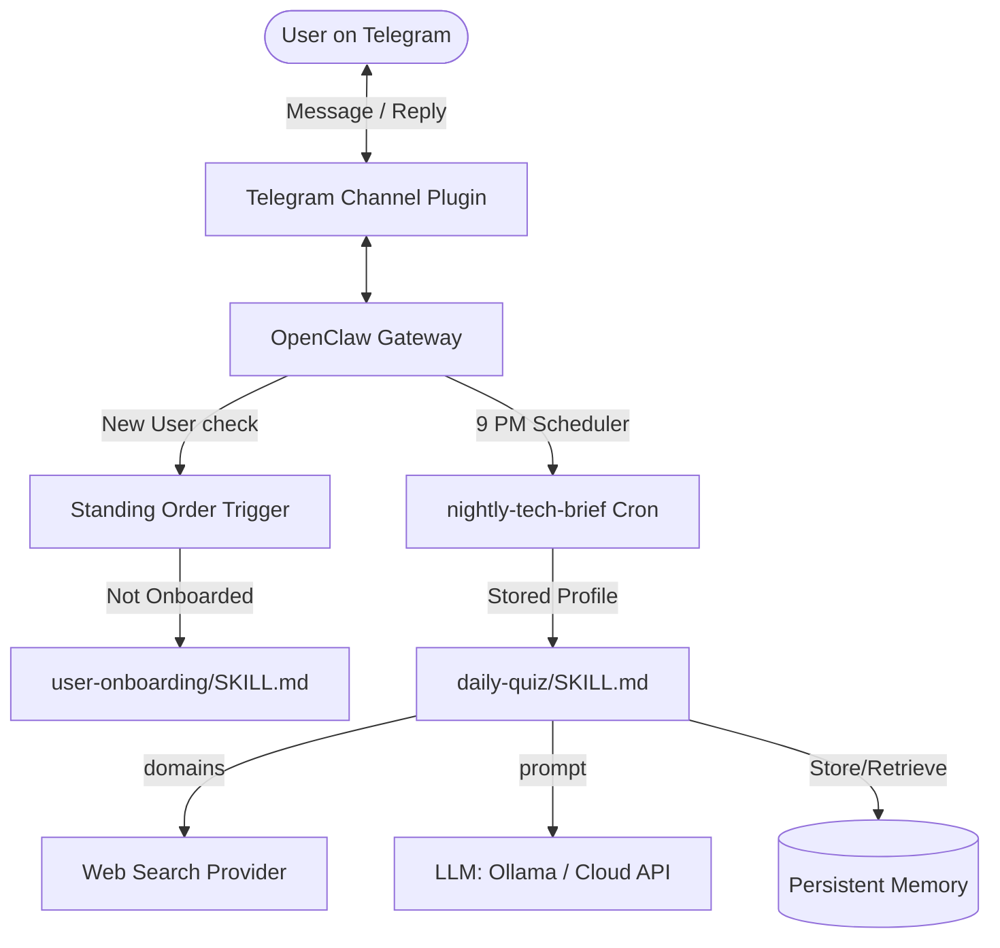

# 🦞 Personalized AI Learning Assistant on Telegram (Powered by OpenClaw)

Welcome to your self-hosted, highly personalized AI study partner. This Telegram bot, built on the **OpenClaw** personal AI framework, acts as your daily mentor: onboarding you to capture your technical interests, experience levels, and goals, and delivering a curated brief of technical insights and interview questions every evening.

---

## 🚀 Features

*   **Friendly Sequential Onboarding**: Interactively interviews new users to gather domain preferences, experience levels, learning goals, and timezones.
*   **Daily Tech Briefs**: Automatically searches the web for fresh, domain-specific news/deep-dives and generates a structured brief.
*   **Curated Quizzes**: Delivers exactly 5 tailored interview questions ranging from conceptual to coding, system design, and behavioral.
*   **Containerized Architecture**: Packaged using Docker and Docker Compose for instant, sandbox-isolated deployments.
*   **Local-First Privacy**: Defaults to running local models using Ollama (`llama3:8b`) to keep all conversation history completely private.

---

## 🛠️ System Architecture



---

## 📦 Project Structure

```
├── skills/
│   ├── user-onboarding/
│   │   └── SKILL.md          # Onboarding flow & memory storage instructions
│   └── daily-quiz/
│       └── SKILL.md          # Web search, quiz generation, & message layout
├── Dockerfile                # Environment recipe for OpenClaw Gateway
├── docker-compose.yml        # Multi-container orchestration (OpenClaw + Ollama)
├── openclaw.json             # Core OpenClaw config file (preconfigured for Docker)
├── openclaw.json.example     # Reference configuration file
├── .env.example              # Sample environment template
└── README.md                 # Project guide and documentation
```

---

## ⚙️ Configuration Setup

### 1. Telegram Bot Token
1. Open Telegram and search for `@BotFather`.
2. Send `/newbot` and follow the instructions to name your bot and choose a username.
3. Save the HTTP API token provided by BotFather (e.g., `123456789:ABCdefGhIJK...`).

### 2. Environment Configuration
Copy the `.env.example` file to `.env`:
```bash
cp .env.example .env
```
Open `.env` and configure your Telegram bot token:
```env
TELEGRAM_BOT_TOKEN=your_telegram_bot_token_here
```

### 3. OpenClaw Configuration Snippet (`openclaw.json`)
The gateway configuration maps to `@openclaw/plugin-telegram` and sets up the LLM provider. Here is the configuration template:

```json
{
  "model": {
    "provider": "ollama",
    "name": "llama3:8b",
    "baseURL": "http://localhost:11434"
  },
  "plugins": {
    "entries": {
      "telegram": {
        "enabled": true,
        "package": "@openclaw/plugin-telegram",
        "config": {
          "botToken": "${env.TELEGRAM_BOT_TOKEN}"
        }
      }
    }
  }
}
```
*Note: In the Docker Compose environment, `baseURL` points to `http://ollama-service:11434` instead of `localhost`.*

---

## 🐳 Running with Docker (Recommended Setup)

For a fully containerized deployment, run the OpenClaw Gateway alongside a local Ollama instance:

### Step 1: Start the services
```bash
docker-compose up -d
```

### Step 2: Download the Llama 3 Model in the Ollama service
```bash
docker exec -it ollama-service ollama pull llama3:8b
```

### Step 3: Register automation triggers inside the running OpenClaw container
Once the gateway is running, execute these commands to register the onboarding Standing Order and the daily quiz Cron Job:

```bash
# Add Standing Order to trigger onboarding for new users
docker exec -it openclaw-agent openclaw standing-orders add \
  --name "trigger-user-onboarding" \
  --if "memory.user_profile_{{user.id}} does not exist" \
  --run-skill "user-onboarding"

# Add Cron Job to schedule the daily quiz at 9 PM user timezone
docker exec -it openclaw-agent openclaw cron add \
  --name "nightly-tech-brief" \
  --cron "0 21 * * *" \
  --tz "America/New_York" \
  --session isolated \
  --message "Run the daily-quiz skill for the primary user. Use their stored preferences to generate and send the daily brief to them on Telegram." \
  --announce \
  --channel telegram
```

---

## 💻 Manual Setup & Local Running

If you prefer to run OpenClaw directly on your host machine:

### Step 1: Install Node.js & OpenClaw
Ensure Node.js (LTS version) is installed, then install the OpenClaw CLI globally:
```bash
npm i -g openclaw
```

### Step 2: Onboard the Agent
Ensure Ollama is running (`ollama serve` and `ollama pull llama3:8b` already run) and run:
```bash
openclaw onboard
```

### Step 3: Configure Channels & Skills
1. Create directory structure in your home directory:
   ```bash
   mkdir -p ~/.openclaw/skills
   cp -r skills/* ~/.openclaw/skills/
   ```
2. Set up environment variables in `~/.openclaw/.env`:
   ```env
   TELEGRAM_BOT_TOKEN=your_token_here
   ```
3. Edit `~/.openclaw/openclaw.json` to include the Telegram channel plugin.

### Step 4: Register Automations
```bash
openclaw standing-orders add \
  --name "trigger-user-onboarding" \
  --if "memory.user_profile_{{user.id}} does not exist" \
  --run-skill "user-onboarding"

openclaw cron add \
  --name "nightly-tech-brief" \
  --cron "0 21 * * *" \
  --tz "America/New_York" \
  --session isolated \
  --message "Run the daily-quiz skill for the primary user." \
  --announce \
  --channel telegram
```

### Step 5: Start the Gateway
```bash
openclaw gateway start
```

---

## 🔍 Onboarding Trigger: Standing Order vs. Webhook

### Rationale for Choosing Standing Orders
OpenClaw provides two main mechanisms for routing new conversational interactions to skills: **Standing Orders** and **Webhooks**.

We selected **Standing Orders** for this project due to the following core advantages:

1.  **NAT Traversal & Local-First Philosophy**: Webhooks require a public, internet-accessible HTTP endpoint (typically involving setting up tunnels like Ngrok, Cloudflare, or dynamic DNS). Standing Orders execute entirely within the local OpenClaw gateway process using polling/websockets established by the Telegram plugin. This makes the bot work out-of-the-box on local development machines, behind domestic routers, and in restricted private cloud containers.
2.  **State-driven Evaluation**: Standing Orders evaluate rules based on local state (such as checking if a key exists in memory: `memory.user_profile_{{user.id}} does not exist`). This allows the agent to handle the routing logic dynamically based on persistent storage rather than forcing incoming HTTP routing tables to manage user sessions.
3.  **Security and Simplicity**: Tunnelling local HTTP services to the public internet opens security attack surfaces. Standing orders don't expose any port to the public web, significantly minimizing security risks.

---

## 🧪 Verification and Testing

### 1. Test User Onboarding
1. Send any initial message (e.g., `"Hello"`) to your Telegram bot.
2. The bot should greet you and ask:
   * Technical domains (e.g., Go, Python)
   * Experience level
   * Learning goals
   * Timezone
3. Verify that replying vaguely (e.g., `"dev"`) prompts a clarifying question.
4. Complete the flow and verify the summary.

### 2. Verify Profile in Memory
To inspect if the profile was saved exactly with the required schema, run:
```bash
docker exec -it openclaw-agent openclaw memory get "user_profile_<YOUR_USER_ID>"
```
Expected stored output structure:
```json
{
  "domains": ["Go", "Distributed Systems"],
  "level": "mid-level",
  "goals": ["staying up-to-date", "interview prep"],
  "timezone": "America/New_York"
}
```

### 3. Trigger Daily Quiz Manually
Instead of waiting for 9 PM, you can manually trigger the cron job to send you a brief immediately:
```bash
docker exec -it openclaw-agent openclaw cron trigger "nightly-tech-brief"
```
Verify that the received Telegram message matches the required Markdown format exactly.
"Added improved docker and OpenClaw setup" 
